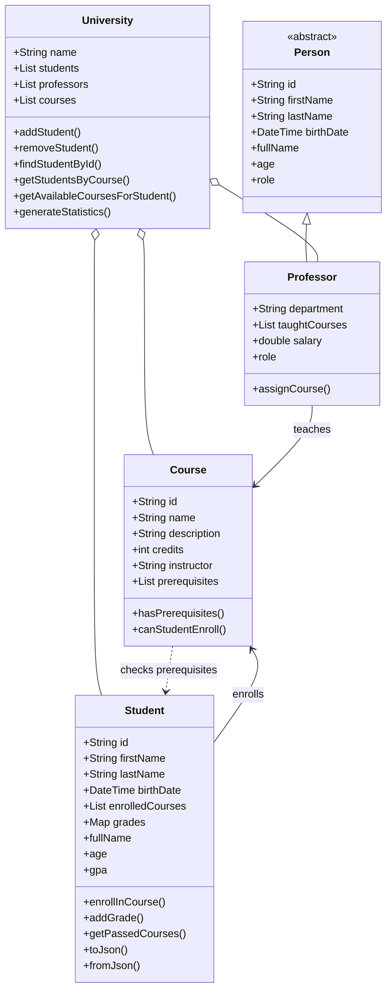

# UML Class Diagram

```mermaid
classDiagram
    Person <|-- Professor
    University o-- Student
    University o-- Professor
    University o-- Course
    Student --> Course : enrolls
    Professor --> Course : teaches
    Course ..> Student : checks prerequisites

    class Person {
        <<abstract>>
        +String id
        +String firstName
        +String lastName
        +DateTime birthDate
        +fullName
        +age
        +role
    }

    class Student {
        +String id
        +String firstName
        +String lastName
        +DateTime birthDate
        +List enrolledCourses
        +Map grades
        +fullName
        +age
        +gpa
        +enrollInCourse()
        +addGrade()
        +getPassedCourses()
        +toJson()
        +fromJson()
    }

    class Professor {
        +String department
        +List taughtCourses
        +double salary
        +role
        +assignCourse()
    }

    class Course {
        +String id
        +String name
        +String description
        +int credits
        +String instructor
        +List prerequisites
        +hasPrerequisites()
        +canStudentEnroll()
    }

    class University {
        +String name
        +List students
        +List professors
        +List courses
        +addStudent()
        +removeStudent()
        +findStudentById()
        +getStudentsByCourse()
        +getAvailableCoursesForStudent()
        +generateStatistics()
    }
```
